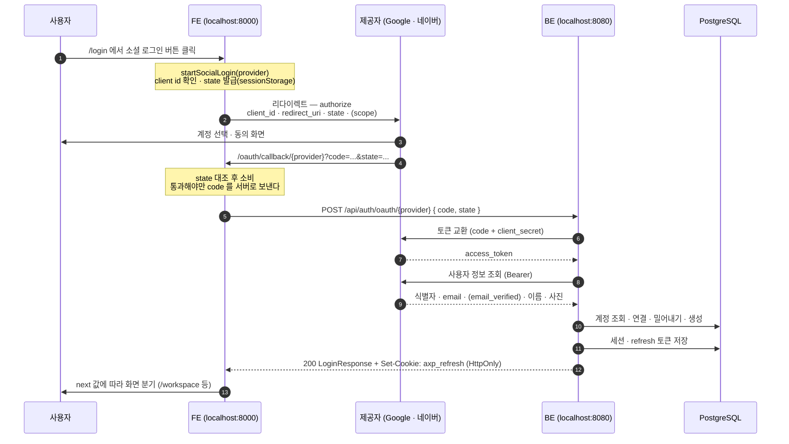

# 소셜 로그인 흐름 — Google · 네이버

버튼을 누른 순간부터 세션이 생길 때까지 FE와 BE의 어느 파일을 지나는지 정리한 문서다.
두 제공자가 같은 경로를 쓴다. 제공자마다 다른 부분은 각 `OAuthClient` 구현체 안에서 흡수되고,
그 뒤로는 하나의 모양만 흐른다.

계정을 잇는 규칙(누가 이 주소의 주인인가)은 분량이 커서 따로 뺐다 —
[`social-login-account-rules.md`](./social-login-account-rules.md).

대상 코드
- FE: `FE/lib/auth.ts`, `FE/app/(auth)/login/page.tsx`, `FE/app/(auth)/oauth/callback/[provider]/page.tsx`
- BE: `BE/src/main/java/com/axcore/workspace/oauth/**`, `.../user/controller/OAuthController.java`,
  `.../user/service/SocialLoginService.java`, `.../user/service/SocialAccountLinker.java`,
  `.../user/service/SessionIssuer.java`, `.../security/RefreshCookieFactory.java`

---

## 한 줄 요약

**code를 받는 것은 FE이고, code를 토큰으로 바꾸는 것은 BE다.**

client secret이 있어야 code를 교환할 수 있는데, 그 값을 브라우저에 내려보내면 누구든 임의의
code를 토큰으로 바꿀 수 있다. 그래서 FE는 code를 받아서 넘기기만 하고 교환은 서버가 한다.

---

## 흐름도



---

## 단계별 경유지

### 1. FE — 로그인 화면

`FE/app/(auth)/login/page.tsx` 의 `loginWith(provider)` 가 `startSocialLogin(provider)` 을 부른다.
`NEXT_PUBLIC_GOOGLE_CLIENT_ID` · `NEXT_PUBLIC_NAVER_CLIENT_ID` 가 없으면 여기서
`SocialLoginNotConfiguredError` 가 나고 "… 로그인이 아직 설정되지 않았습니다" 로 끝난다.
**제공자까지 가지도 않는다.** 그대로 보내면 제공자가 `invalid_client` 오류 페이지를 띄워서
원인이 우리 설정인 것을 알기 어렵다.

### 2. FE — 인증 URL 조립 (`FE/lib/auth.ts`)

세 가지를 한다.

- **state 발급** — `crypto.getRandomValues` 로 만든 난수를 `sessionStorage` 에 넣는다.
  공격자가 자기 계정의 code 로 피해자를 로그인시키는 공격을 막는 값이다. 로그인 전이라
  서버에 이 브라우저를 식별할 세션이 없어서 BE 가 아니라 FE 가 검증한다.
- **redirect_uri 조립** — `window.location.origin + /oauth/callback/{provider}`.
  환경변수로 또 받지 않는다. 어긋날 수 있는 곳을 하나라도 줄이기 위해서다.
- **scope** — Google 은 `openid email profile` 만 요청한다. **네이버는 scope 를 인증 URL 로 받지
  않는다** — 제공받을 항목을 개발자센터 애플리케이션 설정에서 정한다.

Google 에만 붙는 추가 파라미터: `prompt=select_account`(항상 계정 선택),
`access_type=online`(refresh 토큰을 받지 않는다 — 저장할 것도 유출될 것도 없다).

### 3. 제공자 — 동의 화면

| 제공자 | authorize |
| --- | --- |
| Google | `https://accounts.google.com/o/oauth2/v2/auth` |
| 네이버 | `https://nid.naver.com/oauth2.0/authorize` |

콘솔에 등록한 리디렉션 URI 와 문자 단위로 같아야 한다. 다르면 여기서 오류 페이지가 뜬다.

### 4. FE — 콜백 화면

`FE/app/(auth)/oauth/callback/[provider]/page.tsx`. 순서에 의미가 있다.

1. `error` 파라미터 확인 — 사용자가 취소하면 code 대신 이게 온다
2. **state 검증** (`consumeState`) — code 를 보내기 **전에** 한다. 통과 못 한 code 를 서버로
   넘기면 공격자 계정으로 로그인되는 것을 막을 수 없다. 성공·실패 모두 저장값을 지운다
3. `code` 존재 확인
4. `POST /api/auth/oauth/{provider}` 로 `{ code, state }` 전달

**state 를 BE 로 함께 보내지만 BE 가 검증하지는 않는다.** 검증은 위 2번에서 이미 끝났다.
네이버가 토큰 요청에 이 값을 요구해서 BE 가 제공자에게 그대로 넘겨주기 위한 것이다.

`sent.current` ref 로 중복 호출을 막는다. code 는 일회용이라 StrictMode 가 effect 를 두 번
실행하면 두 번째가 실패해 화면이 성공에서 실패로 뒤집힌다.

access 토큰을 `localStorage` 에 저장하지 않는다. refresh 가 HttpOnly 쿠키로 들어와 있어서
언제든 `POST /api/auth/refresh` 로 다시 받을 수 있다.

### 5. BE — 컨트롤러

`OAuthController` · `POST /api/auth/oauth/{provider}`

`SecurityConfig` 에서 `/api/auth/oauth/*` 는 `permitAll` 이다 — 제공자가 발급한 code 를 가진
것 자체가 자격 증명이다. 경로의 `google` · `naver` 를 `AuthProvider` 로 바꾸는 일은 컨트롤러가
직접 한다(`AuthProvider.from`). Spring 기본 열거형 변환은 대문자만 받아서 그대로 두면 500 이
되고, 모르는 제공자는 404 여야 하기 때문이다.

### 6. BE — 서비스 (`SocialLoginService`)

이 클래스는 `@Transactional` 이 **아니다.** 제공자 왕복이 네트워크 호출 두 번이라, 그 동안
DB 커넥션을 잡고 있으면 제공자가 느려질 때 커넥션 풀이 먼저 마른다.

`OAuthClientRegistry` 에서 제공자별 구현체를 찾는다. 없으면 503 이다.

### 7. BE — 제공자 호출 (트랜잭션 밖)

두 번 호출한다. 타임아웃은 연결 3초 / 읽기 5초다 (`OAuthConfig#oauthRestClient`).
기본값이 무한 대기라 명시하지 않으면 로그인 요청이 끝나지 않는다.

| | Google (`GoogleOAuthClient`) | 네이버 (`NaverOAuthClient`) |
| --- | --- | --- |
| 토큰 | `POST oauth2.googleapis.com/token` | `POST nid.naver.com/oauth2.0/token` |
| 토큰 요청 값 | code · client_id · client_secret · **redirect_uri** · grant_type | code · client_id · client_secret · **state** · grant_type |
| 사용자 정보 | `GET openidconnect.googleapis.com/v1/userinfo` | `GET openapi.naver.com/v1/nid/me` |
| 식별자 | `sub` | `id` |
| 사진 | `picture` | `profile_image` |
| 이름 | `name` | `name`, 없으면 `nickname` |
| 실패 신호 | HTTP 4xx | **HTTP 200 + 본문의 `error`** |
| 응답 모양 | 평평함 | **`{resultcode, message, response:{…}}`** |
| `email_verified` | 준다 | **주지 않는다 → 우리가 `true` 로 채운다** |

#### 네이버가 Google 과 다른 네 지점

1. **실패해도 HTTP 200 이다.** 본문에 `error` 를 담아 보낸다. `RestClientException` 을 기다리면
   안 되고 본문을 봐야 한다. 이 검사가 없으면 `access_token` 이 null 인 채로 흘러간다.
2. **토큰 요청에 `state` 가 필요하고 `redirect_uri` 는 보내지 않는다.** Google 과 정반대다.
   `state` 가 비어 있으면 정상 흐름을 거치지 않은 요청이므로 그 자리에서 실패시킨다.
3. **프로필 응답이 한 겹 감싸여 있다.** `resultcode` 가 `"00"` 이 아니면 실패이고, 이것도 200 으로
   온다.
4. **`email_verified` 가 없다.** → [계정 규칙 문서](./social-login-account-rules.md) 참고.

Google 의 토큰 응답에는 `id_token`(JWT)도 함께 오고 그 안에 사용자 정보가 이미 있다. 그런데도
userinfo 를 한 번 더 부르는 이유는 네이버다. 네이버는 OIDC 제공자가 아니라 `id_token` 을 주지
않는다. 두 제공자를 같은 모양으로 처리하면 뒤쪽 로직이 제공자를 몰라도 된다.

두 제공자 모두 **식별자가 없으면 실패시킨다.** 이을 키가 없는데 이메일로 대신 잇는 경로를
만들면 안 된다.

### 8. BE — 계정 연결 (`SocialAccountLinker`, `@Transactional`)

소셜 로그인의 보안 판단이 전부 여기에 있다. `provider + 식별자` 로 찾고, 없으면 이메일로 간다.
**이메일을 연결 키로 쓰지 않는다** — 제공자 쪽 이메일은 바뀔 수 있고, 미확인 주소를 받아
이으면 남의 계정에 들어가는 경로가 된다.

다섯 갈래이고 판단에 쓰는 값은 둘뿐이다 — **주소를 쥔 계정이 확인됐는가**, **제공자가 이
이메일의 소유를 확인해 줬는가**.

| 주소를 쥔 계정 | 제공자 확인 | 결과 |
| --- | --- | --- |
| (이미 연결된 소셜 계정) | — | 그 계정으로 로그인. 이메일은 보지 않는다 |
| 없음 | — | 계정을 새로 만든다 |
| **확인된 계정** | 확인해 줌 | 그 계정에 연결한다 |
| **확인된 계정** | 안 해 줌 | **409** — 허용하면 계정 탈취가 된다 |
| **미확인 계정** | 확인해 줌 | **밀어내고** 새로 만든다 |
| **미확인 계정** | 안 해 줌 | **409** — 어느 쪽도 주인이라는 증거가 없다 |

밀어내기의 근거와 대가는 [계정 규칙 문서](./social-login-account-rules.md)에 있다.

### 9. BE — 2단계 인증 검사

`SessionIssuer#requiresMfa`. **소셜로 들어왔다고 면제하지 않는다.** 면제하면 2단계를 켜 둔
사용자의 방어가 소셜 버튼 하나로 사라진다. 공격자가 그 사람의 제공자 계정을 쥐고 있는 상황이
바로 2단계가 막으려는 상황이다.

2단계가 켜져 있으면 `MfaService#startLoginChallenge` 로 챌린지 토큰을 만들고
`next=MFA_REQUIRED` 로 끝난다. **이 경로에는 refresh 쿠키가 붙지 않는다.**
세션은 `POST /api/auth/mfa/verify` 에서 생긴다.

### 10. BE — 세션 발급 (`SessionIssuer#issueNewSession`)

`recordLogin` → refresh 토큰 발급·저장 → access JWT 발급 → `next` 계산.

`next` 는 이 순서다. 이메일 확인이 회사 선택보다 앞이다 — 소유가 확인되지 않은 주소로 회사에
들어가면 오타로 남의 주소를 적은 계정이 그 회사 데이터를 보게 된다.

```
이메일 미확인            → EMAIL_VERIFICATION_REQUIRED
세션에 workspaceId 없음  → SELECT_WORKSPACE
그 외                    → READY
```

### 11. BE — 응답 (`RefreshCookieFactory#toResponse`)

refresh 토큰이 있을 때만 `Set-Cookie: axp_refresh` 를 붙인다. 호출부가 매번 판단하면
2단계가 끝나기 전에 쿠키가 나가는 경로가 생긴다.

쿠키 속성: `HttpOnly`(코드 고정) · `Path=/api/auth` · `SameSite=Lax` · `Secure`(설정).
"로그인 유지" 를 끄면 `Max-Age` 를 붙이지 않아 브라우저를 닫으면 사라진다.

### 12. FE — 화면 분기

콜백 페이지가 `next` 로 갈린다. **이메일 로그인과 완전히 같은 분기다** — 어느 경로로
들어왔는지 FE 가 알 필요가 없다.

| `next` | 화면 |
| --- | --- |
| `MFA_REQUIRED` | 2단계 안내 (코드 입력 화면은 **아직 미구현**) |
| `EMAIL_VERIFICATION_REQUIRED` | 확인 메일 안내 |
| `SELECT_WORKSPACE` · `READY` | `/workspace` 로 이동 |

---

## 설정

리디렉션 URI 는 **콘솔과 `BE/.env` 가 문자 단위로 같아야 한다.** FE 는 현재 주소에서 자동으로
조립하므로 따로 설정하지 않는다. 하나라도 다르면 7단계의 토큰 교환이 거절된다.

| 위치 | 키 | 값 |
| --- | --- | --- |
| Google Cloud Console | 승인된 리디렉션 URI | `http://localhost:8000/oauth/callback/google` |
| 네이버 개발자센터 | Callback URL | `http://localhost:8000/oauth/callback/naver` |
| `BE/.env` | `GOOGLE_REDIRECT_URI` | 위 Google 값과 동일 |
| `BE/.env` | `NAVER_REDIRECT_URI` | 위 네이버 값과 동일 |

| 위치 | 키 | 비고 |
| --- | --- | --- |
| `BE/.env` | `GOOGLE_CLIENT_ID` / `NAVER_CLIENT_ID` | FE 와 같은 값 |
| `BE/.env` | `GOOGLE_CLIENT_SECRET` / `NAVER_CLIENT_SECRET` | **BE 에만 있어야 한다** |
| `FE/.env.local` | `NEXT_PUBLIC_GOOGLE_CLIENT_ID` | 공개돼도 되는 값이라 `NEXT_PUBLIC_` 이 맞다 |
| `FE/.env.local` | `NEXT_PUBLIC_NAVER_CLIENT_ID` | 같음 |
| `FE/.env.local` | `NEXT_PUBLIC_API_BASE_URL` | 기본값 `http://localhost:8080` |

**네이버 개발자센터에서 제공 정보에 "이메일 주소"를 필수로 체크해야 한다.** 빠지면 사용자가
동의 화면에서 거절할 수 있고, 이메일이 없으면 계정을 이을 수 없어 400 이 난다.

세 값(`client-id` · `client-secret` · `redirect-uri`)이 모두 채워진 제공자만 활성이다
(`OAuthProperties.Registration#isConfigured`). 하나라도 비면 그 제공자만 꺼지고 부팅은 된다 —
자격증명을 발급받지 않은 개발자도 서버를 띄울 수 있어야 한다.

BE 는 `spring.config.import=optional:file:.env[.properties]` 로 `.env` 를 읽는다.
**`BE/` 폴더에서 실행해야 한다.**

---

## 실패 지점과 응답 코드

| 증상 | 어디서 | 원인 |
| --- | --- | --- |
| "… 로그인이 아직 설정되지 않았습니다" | FE 1단계 | `NEXT_PUBLIC_*_CLIENT_ID` 없음 |
| 제공자 오류 페이지 | 3단계 | 콘솔에 등록된 리디렉션 URI 와 불일치 |
| "로그인 요청을 확인할 수 없습니다" | FE 4단계 | state 불일치. 콜백 URL 을 직접 열었거나 탭이 바뀐 경우 |
| **503** | BE 6·7단계 | `OAuthNotConfiguredException` — `.env` 를 못 읽었거나 그 제공자 값이 비었다 |
| **401** | BE 7단계 | `OAuthExchangeException` — 리디렉션 URI 불일치 · code 만료 · code 재사용 · state 누락. BE 로그에 WARN |
| **400** | BE 8단계 | `SocialEmailUnavailableException` — 제공자가 이메일을 주지 않았다. 네이버 제공 항목 설정을 확인한다 |
| **409** | BE 8단계 | `SocialLinkBlockedException` — 자동 연결 불가. [계정 규칙 문서](./social-login-account-rules.md) 참고 |
| **404** | BE 5단계 | 지원하지 않는 제공자 |

응답 본문에 제공자의 `error_description` 을 그대로 싣지 않는다. 사용자가 할 수 있는 일은
재시도뿐이고, 흘리면 제공자 응답을 탐색하는 통로가 된다. 원인은 BE 로그에서 본다.

---

## 확인용 쿼리

```sql
SELECT u.email,
       u.email_verified_at,
       u.password_hash IS NULL AS 소셜전용,
       i.provider,
       i.provider_user_id
FROM shared.users u
JOIN shared.user_identities i ON i.user_id = u.id;
```

`email_verified_at` 에 시각이 찍혀 있으면 이메일 확인이 끝난 계정이다.
`소셜전용 = true` 면 비밀번호 자격증명이 없다(`V5__social_login.sql` 에서 `password_hash` 의
NOT NULL 을 푼 이유다).
