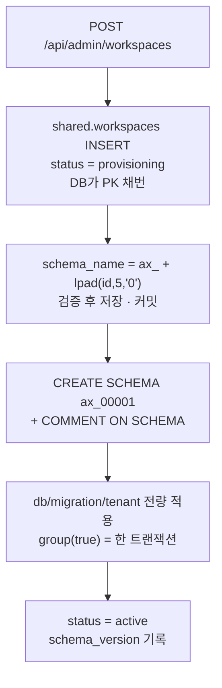

# 테넌트 스키마 프로비저닝 · 워크스페이스 관리

회사 하나에 PostgreSQL 스키마 하나를 붙이는 자동화와, 그 회사를 운영자가 관리하는 API다.

설계 근거는 [`../db/schema-draft-v2.md`](../db/schema-draft-v2.md)에 있다. 여기서는 실제로
무엇이 어떻게 구현됐는지만 적는다.

대상 코드
- `BE/.../workspace/provisioning/**` — 스키마 이름 · 프로비저닝 · 순회 배포
- `BE/.../workspace/admin/**` — 운영자 API
- `BE/src/main/resources/db/migration/tenant/**` — 회사마다 한 벌씩 적용되는 마이그레이션
- `BE/src/main/resources/db/migration/shared/V7~V9`

---

## 방식이 명세서와 다르다

PRD 2.2는 **고객이 사업자번호·상호로 검색해 직접 워크스페이스를 만드는** 흐름이다.
그 방식을 쓰지 않는다. 계약이 끝난 회사를 **우리가 대신 열고 접속 링크를 보낸다.**

그래서 개설 API는 전부 운영자 전용이고, 개설 화면이 받는 값이 그대로
`shared.workspaces`의 컬럼이 된다.

---

## 스키마 이름

```
ax_<workspaces.id · 0채움 5자리>       예) ax_00001 · ax_00142 · ax_100000
```

`SchemaName.of(long)` 하나가 이 규칙의 유일한 구현이다.

- **접두사는 문법상 필수다.** PostgreSQL 식별자는 숫자로 시작할 수 없다
- **회사명이 들어가지 않는다.** PK가 유일하므로 충돌이 불가능하고, 회사명이 바뀌어도 스키마는
  영향받지 않는다
- **5자리를 넘으면 자연 증가한다.** 사전순 정렬만 어긋나는데, 정렬은 `id`로 한다 —
  스키마 이름을 정렬 키로 쓰지 않는다

### 애플리케이션에는 SQL을 잇는 자리가 없다

스키마 이름은 **식별자**라 바인딩 파라미터로 넘길 수 없다.

```java
jdbc.query("... WHERE email = ?", email);      // 값 — 바인딩 가능
jdbc.execute("CREATE SCHEMA ?", schema);       // 식별자 — 이런 문법이 없다
jdbc.execute("SET search_path TO ?", schema);  // 식별자 — 없다
```

그래서 조립이 필요한 자리를 전부 **DB 함수로 옮겼다.** `format`의 `%I`(식별자 인용) ·
`%L`(리터럴 인용)이 이스케이프를 서버에서 처리한다.

| 자리 | 어떻게 |
| --- | --- |
| `CREATE SCHEMA` | `shared.create_tenant_schema(?)` — `format('CREATE SCHEMA IF NOT EXISTS %I', ...)` |
| `COMMENT ON SCHEMA` | `shared.workspace_comment(?, ?)` — `format('COMMENT ON SCHEMA %I IS %L', ...)` |
| `search_path` 열기 | `set_config('search_path', ?, true)` — **함수라서 값으로 바인딩된다** |

`set_config`가 핵심이다. `SET search_path`는 식별자를 요구하지만 `set_config`는 설정 이름과
값을 **text 인자로 받는 함수**라 그냥 바인딩된다.

### 그런데도 형태를 세 곳에서 검증한다

**바인딩이 막아 주는 것은 SQL 인젝션까지이기 때문이다.** `ax_00002`처럼 형태가 멀쩡한 **남의**
스키마 이름은 바인딩을 그대로 통과하고, 그러면 다른 회사 데이터가 열린다. 이 자리에는 위험이
둘 있고 바인딩은 그중 하나만 막는다.

| 위치 | 무엇 |
| --- | --- |
| `SchemaName.requireValid()` | 쓰기 직전. 검증한 값을 그대로 돌려줘 검증과 사용이 한 줄에 붙는다 |
| `ck_workspaces_schema_name` | DB CHECK 제약. 애플리케이션을 우회한 경로(수동 SQL·덤프 복원)로 들어온 값도 막는다 |
| 두 함수 안 | 함수 자체가 임의 식별자에 DDL을 실행하는 도구라 호출자를 믿지 않는다 |

정규식은 셋 다 `^ax_[0-9]{5,}$`로 같다. 그리고 "이 사람이 이 회사에 들어갈 수 있는가"는
형태 검증이 아니라 `user_workspace_memberships`로 호출부가 따로 확인해야 한다.

```
$ SELECT shared.create_tenant_schema('ax_00099; DROP SCHEMA shared CASCADE; --');
ERROR:  허용되지 않는 스키마 이름입니다: ax_00099; DROP SCHEMA shared CASCADE; --
```

---

## search_path 와 HikariCP — 커넥션 재사용 문제

`search_path`는 **세션 상태**다. HikariCP는 물리 커넥션을 재사용하므로, 세션 수준으로 설정하고
반납하면 **다음 요청이 그 값을 물려받는다.** 그 요청은 남의 회사 데이터를 읽는다.

Hikari가 반납 때 되돌려 주는 것은 `autoCommit` · `readOnly` · `transactionIsolation` ·
`catalog` · `schema` · `networkTimeout` 뿐이다. **`search_path`는 그 목록에 없다.**
`connectionInitSql`도 커넥션을 *새로 만들 때* 한 번 돌 뿐 대여·반납마다 돌지 않는다.

### 대책 — 트랜잭션 로컬

`set_config`의 세 번째 인자가 `is_local`이다. `true`면 **COMMIT·ROLLBACK과 함께 저절로
사라진다.**

```sql
BEGIN;
SELECT set_config('search_path', 'ax_00004, shared', true);
SELECT current_setting('search_path');   -- ax_00004, shared
COMMIT;
SELECT current_setting('search_path');   -- "$user", public   ← 돌아왔다
```

`false`였다면:

```sql
BEGIN;
SELECT set_config('search_path', 'ax_00004, shared', false);
COMMIT;
SELECT current_setting('search_path');   -- ax_00004, shared  ← 남는다. 이게 누출이다
```

커넥션이 풀로 돌아갈 때 이미 원래 값이므로 **반납 코드를 따로 두지 않아도 되고, 그 반납
코드를 빠뜨려서 새는 경로 자체가 없다.**

### 대신 트랜잭션이 필수가 된다

트랜잭션 밖에서는 문장 하나하나가 각자 트랜잭션이라 `is_local=true`가 그 한 문장만 살고
사라진다. 스키마를 열어 놓고 이어서 조회하는 것이 불가능하다.

조용히 `shared`를 읽어 빈 결과가 나오는 대신 `TenantSearchPath.bind()`가 바로 막는다.

```java
if (!TransactionSynchronizationManager.isActualTransactionActive()) {
    throw new IllegalStateException("테넌트 스키마는 트랜잭션 안에서만 열 수 있습니다...");
}
```

### `public`을 검색 경로에 넣지 않는다

값은 `ax_00004, shared`다. `public`이 검색 경로에 있으면 거기에 같은 이름의 함수·테이블을 만들
수 있는 사람이 우리 쿼리가 무엇을 부를지 바꿀 수 있다. 확장 함수는 `public.gen_random_uuid()`
처럼 스키마를 붙여 부른다.

### Flyway는 아예 다른 풀을 쓴다

Flyway는 대상 스키마를 잡으려고 **자기가 빌린 커넥션의 `search_path`를 바꾼다.** 그 커넥션이
요청 처리용 풀에서 나온 것이면 위와 같은 누출 경로가 된다.

Flyway가 닫을 때 원래 값을 되돌리기는 하지만, 그건 라이브러리 내부 동작이다. **테넌트 격리를
남의 구현 세부에 기대지 않는다** — 애초에 요청을 처리하지 않는 풀을 쓰면 되돌리든 말든
상관없다.

`ProvisioningDataSource`가 그 풀이다 (`axcore-provisioning`, max 2). DDL이 요청용 커넥션을
잡아먹지 않는다는 이점도 함께 온다.

> `DataSource` 타입 빈을 직접 만들면 Spring Boot의 `DataSourceAutoConfiguration`이
> (`@ConditionalOnMissingBean(DataSource.class)`) **통째로 꺼진다.** 그래서 한 겹 감싸
> 타입을 감췄다.

---

## 개설 흐름



### 트랜잭션이 세 덩어리로 나뉜다

이게 구현의 핵심이다.

| 단계 | 트랜잭션 | 이유 |
| --- | --- | --- |
| 1. 행 INSERT + 스키마 이름 | `WorkspaceRegistrar.register()` | PK가 있어야 이름을 만들 수 있다. **커밋돼야** 다음 단계가 본다 |
| 2. CREATE SCHEMA + 마이그레이션 | **트랜잭션 밖** | Flyway가 자기 커넥션에서 자기 트랜잭션으로 돈다 |
| 3. status = active | `WorkspaceRegistrar.activate()` | 스키마가 실제로 선 뒤에만 |

1번과 2번을 한 트랜잭션에 넣으면 안 된다. Flyway는 다른 커넥션을 쓰므로 아직 커밋되지 않은
`workspaces` 행을 볼 수 없고, DDL이 도는 내내 그 커넥션을 붙잡고 있게 된다.

> **`AdminWorkspaceService`와 `WorkspaceRegistrar`가 나뉘어 있는 이유가 이것이다.**
> 세 단계를 한 클래스에 두고 서로 부르면 `@Transactional`이 통째로 무시된다 — 자기 자신을
> 부르는 호출은 스프링 프록시를 거치지 않는다. 그러면 세 단계가 하나의 트랜잭션도, 세 개의
> 트랜잭션도 아닌 상태가 된다.

### 실패하면 반쪽 스키마가 남지 않는다

PostgreSQL은 **DDL이 트랜잭션 안에서 롤백된다.** 테넌트 마이그레이션을 `group(true)`로 전량
묶어 두었으므로, 테이블을 만들다 중간에 실패하면 앞의 것들도 함께 사라진다.

남는 것은 `provisioning` 상태의 행 하나다. 지우지 않는다 — 무엇이 왜 실패했는지가 남아야 하고,
목록에서 상태로 구분된다.

```
POST /api/admin/workspaces/{id}/provision      다시 시도
```

`CREATE SCHEMA IF NOT EXISTS` + Flyway 이력 덕분에 두 번 돌아도 안전하다.

**실패한 PK는 재사용하지 않는다.** identity 시퀀스는 롤백돼도 되감기지 않으므로 `ax_00007`에서
실패하면 다음 회사는 `ax_00008`이 된다. 번호에 구멍이 생기지만 스키마 이름은 순번일 뿐 개수를
세는 값이 아니다.

---

## 테넌트 마이그레이션

`db/migration/tenant`의 파일은 **회사마다 한 벌씩** 적용된다.

**프로비저닝과 순회 배포가 같은 파일을 쓴다.** 신규 회사는 "빈 스키마에 처음부터 전량 적용"한
것이고 기존 회사는 "밀린 것만 적용"한 것이다. 두 경로가 갈리지 않으므로 *새로 만든 스키마만
구조가 다른* 사고가 나지 않는다.

**파일에 스키마 이름을 적지 않는다.** Flyway가 대상 스키마를 잡아 주므로 테이블 이름만 쓴다.
`ax_00001`처럼 박아 두면 한 회사에만 적용되는 마이그레이션이 된다.

### 지금 있는 것 — 회원·조직 6 tables

| 테이블 | 내용 |
| --- | --- |
| `roles` | 역할 정의. `is_admin` · `can_invite` · `is_system` |
| `departments` | 부서 |
| `members` | 구성원. `user_id`가 `shared.users`를 가리키는 **크로스 스키마 FK** |
| `role_module_grants` | 역할이 위임받은 기능 범위 |
| `member_module_grants` | 개인에게 부여된 기능 |
| `invitation_module_grants` | 초대에 담긴 기능. 수락 시 `member_module_grants`로 복사 |

`V2__default_roles.sql`이 기본 역할 3개(`owner`·`admin`·`member`)와 기본 부서 `미지정`을 심는다.
코드가 아니라 마이그레이션으로 두는 이유는 프로비저닝과 순회 배포가 같은 스크립트를 쓴다는
성질을 지키기 위해서다.

> 설계문서의 최종안은 26개다. 나머지(설정·연동 7 / 제품설계 4 / 재고·물류 …)는 해당 도메인을
> 만드는 시점에 `V3__…` 로 붙인다. 그게 이 구조의 의도다.

### v1 대비 달라진 것

`workspace_id` · `organization_id` 컬럼이 전부 사라졌다. 스키마 하나가 곧 회사 하나라 모든
행이 이미 그 회사 것이고, 조인마다 붙이던 조건이 필요 없다.

### 순회 배포

```
POST /api/admin/workspaces/migrate
```

**부팅 시점에 돌지 않는다.** 스키마가 늘수록 부팅이 선형으로 느려지고, 인스턴스 여러 대가
동시에 부팅하면 같은 스키마를 동시에 건드린다. `spring.flyway.locations`는
`db/migration/shared`만 가리키므로 테넌트 경로는 부팅 경로에 없다.

- 대상은 `active` + `suspended`. `provisioning`은 스키마가 없거나 만들다 실패한 것이라 되살리면
  안 되고, `terminated`는 지울 예정이라 새 구조를 밀어 넣을 이유가 없다
- **한 스키마가 실패해도 멈추지 않는다.** 각 스키마가 자기 `flyway_schema_history`를 가지므로
  서로 영향이 없다. 실패한 것만 응답의 `failures`로 돌려준다
- 일부 실패해도 **200**이다. 한 회사의 실패를 전체 실패로 표현하면 성공한 것들의 결과가 사라진다

나중에 배포 파이프라인의 CLI 커맨드로 옮겨도 `TenantMigrationRunner`는 그대로 쓴다.

### 삭제는 즉시 하지 않는다

`DELETE /api/admin/workspaces/{id}` 는 **상태만 `terminated`로 바꾼다. 스키마를 지우지 않는다.**

`DROP SCHEMA ... CASCADE` 한 줄이면 되지만 되돌릴 수 없다. 유예기간이 지난 뒤 덤프를 남기고
배치가 실제로 지우는 순서가 맞는데, **그 배치는 아직 없다.** 지금은 해지된 스키마가 그대로
남아 있으며 이것이 의도된 상태다.

---

## 운영자 권한

`shared.users.is_internal_admin` 플래그 하나다.

**값을 토큰에 싣지 않는다.** access 토큰은 최대 TTL(15분)만큼 살아 있어서, 클레임으로 두면
권한을 회수해도 그동안 계속 통한다. 회사 선택이 매번 소속을 다시 확인하는 것과 같은 판단이다.

그래서 `SecurityConfig`의 `/api/admin/**` 규칙은 `authenticated()`까지만 가르고, 실제 판정은
`AdminWorkspaceService.requireInternalAdmin()`이 **요청 시점의 DB**로 한다. 컨트롤러의 모든
메서드가 이걸 첫 줄에서 부른다 — 애너테이션 하나로 처리하지 않는 이유는 빠뜨렸을 때 조용히
열리기 때문이다.

값을 바꾸는 API는 없다. DB에서 직접 켠다.

```sql
UPDATE shared.users SET is_internal_admin = true WHERE email = '...';
```

---

## API

전부 운영자 전용이다. 운영자가 아니면 **403**.

| 메서드 | 경로 | 설명 |
| --- | --- | --- |
| `GET` | `/api/admin/workspaces` | 목록. `keyword` · `status` · `page` · `size` |
| `GET` | `/api/admin/workspaces/{id}` | 상세 |
| `POST` | `/api/admin/workspaces` | 개설 + 프로비저닝. **201** |
| `PUT` | `/api/admin/workspaces/{id}` | 상세 수정 (**전체 교체**) |
| `POST` | `/api/admin/workspaces/{id}/provision` | 실패한 개설 재시도 |
| `POST` | `/api/admin/workspaces/{id}/suspend` | 진입 차단 |
| `POST` | `/api/admin/workspaces/{id}/resume` | 재개 |
| `POST` | `/api/admin/workspaces/{id}/link-sent` | 접속 링크 발송 기록 |
| `DELETE` | `/api/admin/workspaces/{id}` | 해지 (soft) |
| `POST` | `/api/admin/workspaces/migrate` | 전 스키마 순회 배포 |

### 받지 않는 것

- **수정에서 `bizNumber`** — 회사의 유일성을 보장하는 키라 사실상 불변이다. 바꿔야 하는 상황은
  애초에 잘못 개설한 경우이고, 그때는 해지 후 재개설이 맞다. 사업자번호가 바뀌면 그 스키마
  안의 데이터가 다른 회사 것이 된다
- **수정에서 `status`** — 중지·재개·해지는 각자 전용 엔드포인트가 있다. 상태를 일반 수정에
  섞으면 상호를 고치려다 회사를 닫는 요청이 만들어진다

### PATCH 가 아니라 PUT 인 이유

화면이 상세 폼 전체를 들고 저장을 누른다. PATCH로 두면 null을 "바꾸지 않음"으로 읽어야 하고,
그러면 **값을 비우는 조작을 표현할 수 없다.** 사업장 목록도 통째로 갈아 끼운다.

### 응답 코드

| 코드 | 언제 |
| --- | --- |
| **403** | 운영자가 아니다 (`FORBIDDEN`) |
| **404** | 없는 워크스페이스 (`WORKSPACE_NOT_FOUND`) |
| **409** | 이미 개설된 사업자번호 · 지금 상태에서 할 수 없는 조작 (`WORKSPACE_STATE_CONFLICT`) |
| **400** | 검증 실패 (`VALIDATION_FAILED` + 필드별 문구) |
| **500** | 프로비저닝 실패 (`PROVISIONING_FAILED`). 원인은 응답에 싣지 않는다 — 스키마 이름과 DDL 오류가 그대로 드러난다 |

---

## 확인

```bash
# 운영자 권한 부여
docker exec axcore-postgres psql -U workspace -d workspace \
  -c "UPDATE shared.users SET is_internal_admin = true WHERE email='ops@axcore.ai.kr';"
```

```sql
-- 워크스페이스와 스키마
SELECT id, name, biz_number, schema_name, status, schema_version FROM shared.workspaces ORDER BY id;

-- 테넌트 스키마 목록. 코멘트에 회사명이 붙어 있다
\dn+ ax_*

-- 한 회사의 테이블
SELECT table_name FROM information_schema.tables WHERE table_schema='ax_00001' ORDER BY 1;

-- 기본 역할이 심어졌는가
SELECT code, name, is_admin, can_invite FROM ax_00001.roles ORDER BY id;
```

> **한글 검색을 curl로 테스트할 때** 셸이 CP949로 인코딩해 보내면 Tomcat이 400으로 거절한다
> (`Invalid character found in the request target`). 애플리케이션 문제가 아니다. UTF-8
> 퍼센트 인코딩으로 보내야 한다 — 예: `?keyword=%ED%95%9C%EB%B9%9B`.

---

## 아직 없는 것

| 항목 | 비고 |
| --- | --- |
| **개설자를 첫 관리자로 등록** | 설계문서 흐름의 마지막 단계(`user_workspace_memberships` + 테넌트 `members`)다. 접속 링크를 받은 사람이 처음 들어올 때 붙이는 것이 맞아 링크 발송·수락 기능과 함께 만든다 |
| **접속 링크 발송** | 지금은 `link-sent`가 시각만 기록한다 |
| **해지 유예 후 DROP 배치** | 위 "삭제는 즉시 하지 않는다" 참고 |
| **테넌트 스키마 라우팅** | 선택된 회사의 `search_path`를 실제로 여는 부분. `WorkspaceService.select`가 아직 세션에 기록만 한다. **여는 방법은 `TenantSearchPath`로 이미 만들어 뒀다** — 붙일 때 `SET search_path`를 직접 쓰는 코드가 새로 생기지 않게 하려는 것이 목적이다. 소속 재확인 → `bind()` 순서를 지켜야 한다 |
| **설정·연동 7 tables 외 나머지 테넌트 테이블** | 해당 도메인을 만들 때 `V3__…` 로 |
| **자동화 테스트** | 저장소에 테스트 코드가 아직 없다 |
