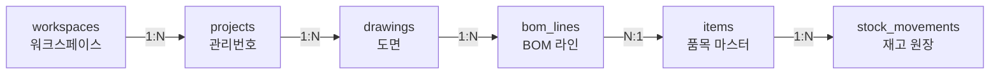
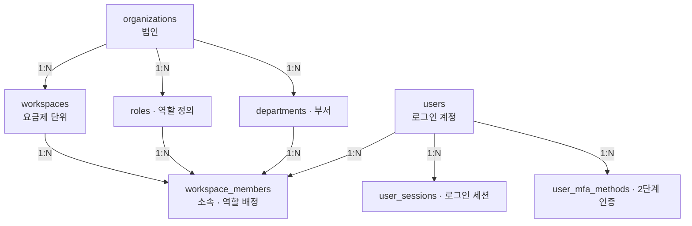
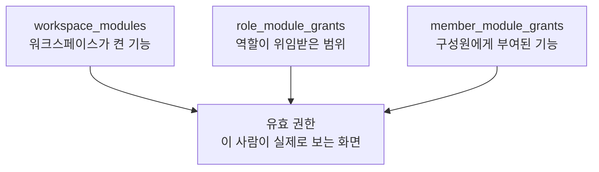
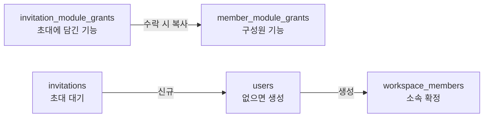
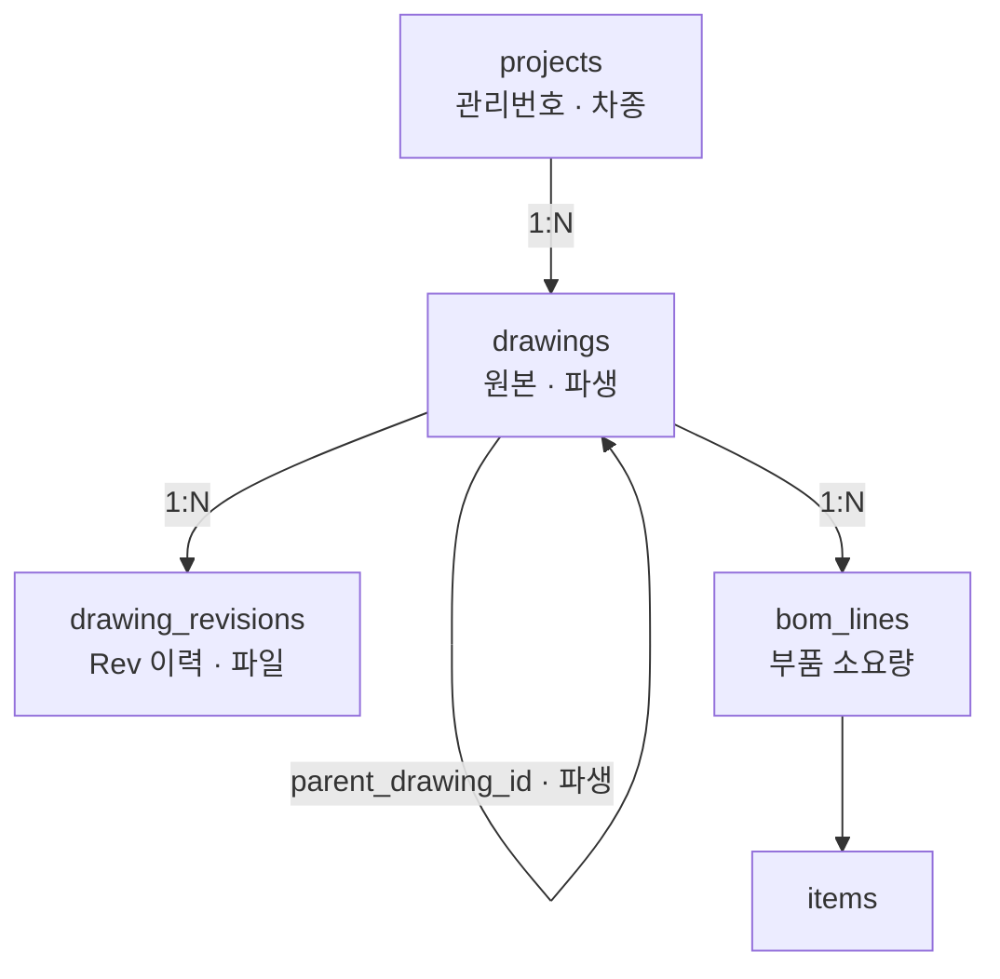
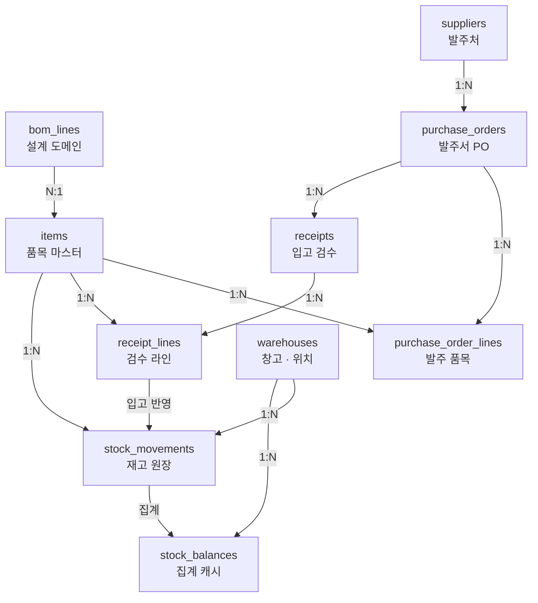

# AXpoint 스키마 관계도

`POSTGRESQL · 설계 초안 V1 · SETTINGS 반영`

설정 화면을 반영해 33개 테이블로 늘렸습니다. 권한이 3층으로 겹쳐 있고, 업무 도메인을 넘나드는
연결은 여전히 세 군데뿐입니다.

| 테이블 | 도메인 | 권한 층 | 도메인 간 연결 | 테넌시 기준 |
|---|---|---|---|---|
| **33** | **4** | **3** | **3** | `workspace_id` |

---

## 업무 흐름 — 하나의 척추

테이블을 다 늘어놓으면 관계가 안 보입니다. 먼저 척추만 보면 이렇습니다. 워크스페이스가 프로젝트를
갖고, 프로젝트에 도면이 달리고, 도면에서 BOM이 나오고, BOM 한 줄이 품목 마스터에 매핑되고,
그 품목의 수량이 원장에 쌓입니다.



| 구간 | 도메인 |
|---|---|
| `workspaces` | 회원 · 조직 |
| `projects` → `bom_lines` | 제품설계 |
| `items` → `stock_movements` | 재고 · 물류 |

> 초록 화살표가 유일한 도메인 경계 통과 지점입니다. `bom_lines.item_id`가 NULL이면 화면의
> "미매핑" 배지이고, 발주가 막히는 이유도 이 한 칸입니다. `projects`(관리번호)는 도면·발주·검수가
> 공통으로 물고 있어 허브 역할을 합니다.

---

## 회원 · 조직 — 12 tables (+8 신규)

설정 화면을 보고 크게 손봤습니다. 부서·역할이 코드에 하드코딩된 배열로 있었는데(`DEPTS`, `ROLES`)
테이블로 뺐고, 2단계 인증·세션·초대가 통째로 빠져 있어 추가했습니다.

### 계정과 소속



*이번에 추가한 테이블: `roles`, `departments`, `user_sessions`, `user_mfa_methods` 외 4종*

> 역할은 사람이 아니라 **"사람 × 워크스페이스"에 붙습니다.** 같은 계정이 A사에서는 관리자,
> B사에서는 구성원일 수 있으므로 `role_id`와 `department_id`는 `users`가 아니라
> `workspace_members`에 있습니다.

### 권한은 세 층이 겹쳐서 결정된다

설정 화면을 보면 권한을 켜는 곳이 세 군데입니다. 워크스페이스 설정에서 모듈을 켜고, 역할마다
위임 범위가 있고, 초대할 때 개인별로 또 켭니다. 셋 중 하나라도 꺼져 있으면 안 보입니다.



> DB에 "유효 권한" 테이블은 없습니다 — 세 테이블의 교집합으로 계산합니다.
> `workspace_modules`는 설정 > 기능 활성화, `role_module_grants`는 초대 팝업의 "위임 범위 밖" 처리,
> `member_module_grants`는 초대 시 켠 기능에 대응합니다.

### 초대가 구성원이 되는 과정



> 초대는 **"아직 계정이 없는 사람"도 대상**이라 별도 테이블이 필요합니다. 화면의 "초대 대기"
> 배지가 이 상태이고, 수락하는 순간 `invitations`에 담아둔 부서·역할·모듈 권한이 실제
> 구성원 레코드로 옮겨집니다.

### 테이블 목록

| 테이블 | 핵심 필드 | 화면 근거 |
|---|---|---|
| `organizations` | `biz_number` · `name` · `ceo_name` | 워크스페이스 생성 시 법인 검색 |
| `workspaces` | `organization_id` · `name` · `plan` | 사이드바 워크스페이스 전환 |
| `users` | `email` · `password_hash` · `password_changed_at` · `avatar_url` · `last_login_at` | 프로필 관리 · 비밀번호 "마지막 변경 2026-05-14" |
| `workspace_members` | `role_id` · `department_id` · `title` · `status` · `last_active_at` | 관리 > 사용자 및 역할 목록 |
| `departments` | `workspace_id` · `name` | 초대 팝업의 부서 드롭다운(하드코딩 제거) |
| `roles` | `code` · `name` · `is_admin` · `can_invite` | 역할 드롭다운 · "초대는 관리자·팀장만" |
| `role_module_grants` | `role_id` · `module_slug` | "위임 범위 밖" 비활성 토글 |
| `member_module_grants` | `member_id` · `module_slug` · `granted_by` | 초대 팝업 "활성화할 기능" |
| `user_mfa_methods` | `method` · `enabled` · `secret_ref` · `verified_at` | 2단계 인증 3종 토글 |
| `user_sessions` | `token_hash` · `user_agent` · `ip` · `expires_at` · `revoked_at` | "모든 기기에서 다시 로그인해야 합니다" |
| `invitations` | `email` · `role_id` · `department_id` · `token_hash` · `status` · `expires_at` | 구성원 초대 · "초대 대기" 배지 |
| `invitation_module_grants` | `invitation_id` · `module_slug` | 초대에 담긴 기능 선택 |

### ⚠ 보안상 확인이 필요한 결정

- **`password_hash`** 는 bcrypt 또는 argon2id로만 저장합니다. 화면의 규칙(영문·숫자·특수문자 8~16자)은
  앱 레벨 검증이고, DB에는 평문이 어떤 형태로도 남지 않습니다.
- **`user_sessions.token_hash`** — 세션 토큰 원문은 저장하지 않고 해시만 둡니다. 비밀번호 변경 시
  이 테이블의 행을 일괄 `revoked_at` 처리하면 "모든 기기 재로그인"이 구현됩니다.
- **`user_mfa_methods.secret_ref`** — TOTP 시드를 컬럼에 직접 넣지 않고 비밀 저장소 참조 키만 둡니다.
  DB 덤프가 유출돼도 2단계 인증이 무력화되지 않게 하려는 의도입니다.
- **`invitations.token_hash`** — 초대 링크 토큰도 해시 저장 + `expires_at` 필수입니다.

---

## 설정 · 연동 — 7 tables (전부 신규)

지금은 모듈 ON/OFF가 `localStorage`에만 있어서 브라우저를 바꾸면 날아갑니다
(`lib/module-state.ts`). 워크스페이스 단위 설정이므로 DB로 옮겨야 합니다. 이 도메인은 전부
`workspaces`에 매달려 있고, 다이어그램으로 그릴 만한 구조가 없어 목록으로 둡니다.

| 테이블 | 핵심 필드 | 화면 근거 |
|---|---|---|
| `workspace_modules` | `workspace_id` · `module_slug` · `enabled` | 설정 > 기능 활성화 (모듈 토글) |
| `workspace_subfunctions` | `workspace_id` · `module_slug` · `subfunction_id` · `enabled` | 모듈 아래 서브기능 토글 |
| `connectors` | `name` · `system_name` · `type` · `endpoint` · `credential_ref` · `status` | 외부 시스템 연동 (ERP/MES/센서) |
| `service_connections` | `service` · `account_label` · `token_ref` · `scopes` · `expires_at` | Slack·Gmail·Drive·Calendar OAuth |
| `notification_prefs` | `event_key` · `inapp` · `email` · `slack` | 알림 설정 (현재 화면은 비활성) |
| `module_sync_rules` | `from_module` · `to_module` · `rule_text` · `enabled` | 모듈 간 데이터 연동 규칙 |
| `audit_logs` | `actor_member_id` · `action` · `target` · `before` · `after` | "역할 변경" 버튼 — 이력이 남아야 함 |

### ⚠ 인증 키는 DB에 넣지 않습니다

- 외부 시스템 팝업의 **인증 키(API Key)** 와 Google OAuth 토큰은 컬럼에 값을 저장하지 않고,
  `credential_ref` / `token_ref`로 비밀 저장소(Supabase Vault, AWS Secrets Manager 등)의
  참조 키만 둡니다.
- 이 값들은 서버 라우트에서만 복호화해 사용하고, `NEXT_PUBLIC_` 접두사가 붙은 어떤 경로로도
  클라이언트에 내려가지 않아야 합니다.
- `audit_logs`의 before/after JSONB에 키·토큰이 실려 들어가지 않도록 기록 대상 필드를
  화이트리스트로 제한해야 합니다.

---

## 제품설계 — 4 tables

도면은 **원본과 파생이 같은 테이블**에 있고 자기 자신을 참조합니다 (조립도 → 상형 가공도).
파생 도면은 상위 도면의 *어느 리비전*을 근거로 만들었는지까지 들고 있어야, 원본이 개정됐을 때
"확인 필요" 판정을 할 수 있습니다.



> 자기참조가 이 도메인의 핵심입니다. `drawings.parent_drawing_id`는 어느 도면에서 파생됐는지를,
> `parent_rev`는 그때 근거로 삼은 리비전을 가리킵니다. 둘을 함께 봐야 "원본은 Rev.C인데 파생은
> Rev.A 기준" 같은 불일치를 잡아낼 수 있습니다.

### 관계

| 자식 (FK 보유) | 부모 | 관계 | 의미 |
|---|---|---|---|
| `projects.workspace_id` | `workspaces` | N : 1 | 테넌시 격리 |
| `drawings.project_id` | `projects` | N : 1 | 원본 도면만 보유, 파생은 NULL |
| `drawings.parent_drawing_id` | `drawings` | N : 1 | 자기참조 — 파생 도면의 상위 도면 |
| `drawing_revisions.drawing_id` | `drawings` | N : 1 | Rev.A · Rev.B — 개정 이력 |
| `bom_lines.drawing_id` | `drawings` | N : 1 | 리비전별 BOM 스냅샷 |

---

## 재고 · 물류 — 9 tables

발주 → 입고 검수 → 재고 반영이 한 줄로 이어집니다. 재고 수량은 `stock_movements` 한 곳에서만
만들어지고, `stock_balances`는 그걸 더해둔 캐시입니다 — 수량을 직접 UPDATE 하는 경로는 두지 않습니다.



> 수량이 재고에 꽂히는 문은 하나뿐입니다. 검수에서 `received_qty`를 확정하면 `stock_movements`에
> 입고 행이 생기고, `stock_balances`는 그 합계를 집계한 캐시일 뿐 독립적인 사실이 아닙니다.
> 점선 상자 `bom_lines`는 설계 도메인 소속으로, 여기서는 들어오는 연결만 표시했습니다.

### 관계

| 자식 (FK 보유) | 부모 | 관계 | 의미 |
|---|---|---|---|
| **`bom_lines.item_id`** | `items` | N : 1 | **NULL = 미매핑 → 발주 차단** |
| `items.warehouse_id` | `warehouses` | N : 1 | 기본 보관 위치 |
| `purchase_orders.supplier_id` | `suppliers` | N : 1 | 발주는 발주처 단위로 채번 |
| `purchase_orders.project_id` | `projects` | N : 1 | 귀속 관리번호 |
| `purchase_orders.drawing_id` | `drawings` | N : 1 | 발주 근거 도면 + 리비전 스냅샷 |
| `purchase_order_lines.purchase_order_id` | `purchase_orders` | N : 1 | 발주 품목 명세 |
| `purchase_order_lines.item_id` | `items` | N : 1 | 품목 마스터 참조 |
| `receipts.purchase_order_id` | `purchase_orders` | N : 1 | 한 발주에 분할 입고 여러 건 |
| `receipt_lines.receipt_id` | `receipts` | N : 1 | 라인 단위 검수 결과 |
| `receipt_lines.item_id` | `items` | N : 1 | 품목 마스터 참조 |
| **`stock_movements.receipt_line_id`** | `receipt_lines` | N : 1 | **입고 기인 변동의 근거** |
| `stock_movements.item_id` | `items` | N : 1 | 어느 품목이 움직였나 |
| `stock_movements.warehouse_id` | `warehouses` | N : 1 | 어느 창고에서 |
| `stock_balances.item_id` · `warehouse_id` | `items` · `warehouses` | 1 : 1 | 복합 PK — 품목 × 창고당 한 행 |

---

## 업무 도메인을 잇는 세 개의 다리

나머지 관계는 전부 도메인 안에서 끝납니다. 도메인 경계를 넘는 건 아래 셋뿐이고, 기능이 막히거나
데이터가 어긋나는 사고는 대부분 이 세 곳에서 납니다.

### 1. 관리번호 허브
```
projects ← drawings
projects ← purchase_orders
```
화면에서 "26MSX-S03 OP20" 하나로 도면·발주·검수를 다 찾을 수 있는 이유. 문자열로 흩어두면
오타 하나에 추적이 끊기므로 테이블로 뺐습니다.

### 2. 설계 ↔ 재고
```
bom_lines.item_id → items
```
도면의 BOM 표기("GUIDE POST / MYKP")를 실제 품목 코드에 붙이는 단 한 지점. 여기가 NULL이면
소요량 계산도 발주도 진행되지 않습니다.

### 3. 검수 → 재고
```
stock_movements.receipt_line_id → receipt_lines
```
입고 수량이 재고가 되는 문. 이 FK 덕분에 재고 한 줄에서 "어느 발주의 어느 검수 라인에서 왔는지"
역추적이 됩니다.

> 권한 도메인은 여기에 FK로 끼어들지 않습니다. `module_slug` 문자열(`'inventory'`, `'design'` …)로만
> 연결돼 있어서, 모듈을 껐다 켜도 업무 데이터는 그대로 남습니다 — 화면의 "OFF 상태에서도 데이터는
> 보존" 원칙과 같습니다.

---

## 짚어둘 판단과 남은 결정

**모듈 카탈로그를 DB에 둘까**
8개 모듈과 서브기능 목록이 지금은 코드(`data/modules.ts`)에 있습니다. 권한 테이블들은 `module_slug`
문자열로 참조만 하게 됐는데, 오타를 DB가 못 잡습니다. 카탈로그 테이블을 만들어 FK를 걸지,
코드를 단일 소스로 유지할지 결정이 필요합니다.

**멀티테넌시 방식**
주요 테이블마다 `workspace_id`를 두는 방식입니다. Supabase RLS를 이 컬럼 기준으로 걸 수 있어 잘
맞지만, 자식 테이블(`receipt_lines`, `member_module_grants` 등)에는 컬럼이 없어 조인이 필요합니다.
전부에 중복 저장할지 정해야 합니다.

**역할을 고정할까 자유롭게 둘까**
`roles`를 워크스페이스별 테이블로 뺐습니다. 조직마다 역할을 추가할 수 있는 대신, "관리자"처럼
시스템이 의미를 아는 역할은 `code`로 구분해야 합니다. 시스템 기본 역할 + 커스텀 역할 혼합 구조로
갈지 확인이 필요합니다.

**BOM 리비전 스냅샷**
`bom_lines.rev`를 문자열로 들고 있습니다. `drawing_revisions.id`를 FK로 거는 편이 정합성은 낫지만,
도면 등록 시 BOM만 먼저 들어오는 흐름이 있어 느슨하게 뒀습니다.

**상태값 표현**
`VARCHAR` + 한글 리터럴('활성', '부분 입고')로 뒀습니다. 화면 문구와 1:1이라 읽기는 쉽지만, 문구가
바뀌면 데이터 마이그레이션이 따라옵니다. ENUM이나 코드값 + 표시명 분리로 바꿀지 결정이 필요합니다.

**아직 없는 것**
안전재고 기준은 아직 아무 데도 두지 않았습니다. `items` 컬럼으로 얹으면 창고별 기준을 잡을 수 없어,
필요해질 때 별도 테이블로 설계합니다. 출고 요청·재고 실사, 그리고 소셜 로그인(`user_identities`)도
아직 테이블이 없습니다.

---

`AXPOINT · DB SCHEMA DRAFT v1` — `33 TABLES / 4 DOMAINS`

---

### 전사(轉寫) 메모

이 문서는 아티팩트 `4c1b6388-a2ed-4040-a675-ba22e77edee4`의 PDF 캡처(3페이지, 텍스트 레이어 없는
JPEG 이미지)에서 옮겨 적은 것입니다. 다이어그램은 원본의 박스 그림을 mermaid로 옮겼습니다.
"재고 · 물류" 다이어그램 아래 캡션 한 문단은 2~3페이지 경계에서 잘려 있어, 양쪽에 남은 텍스트로
이어 붙였습니다.
