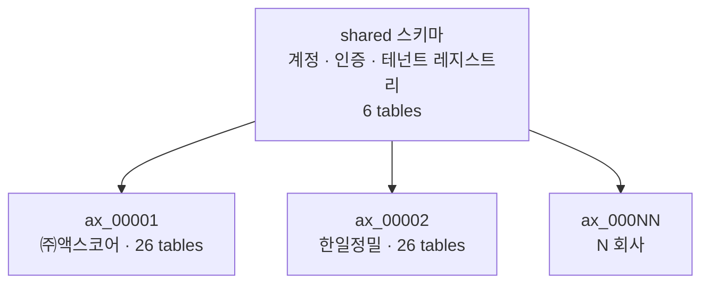
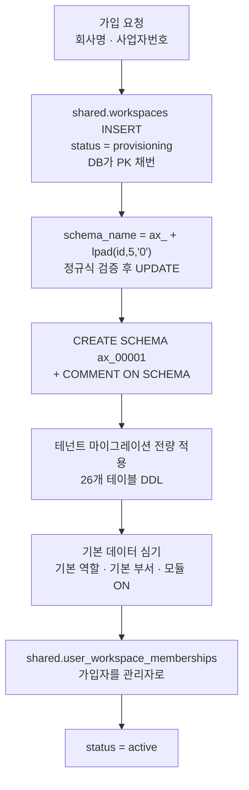
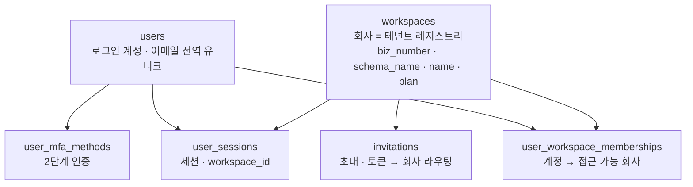
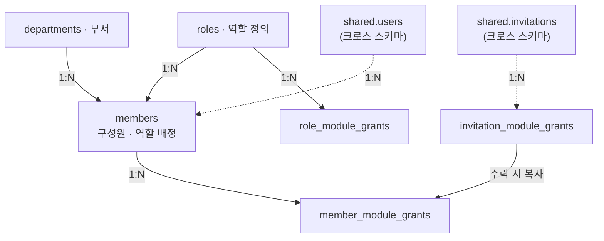
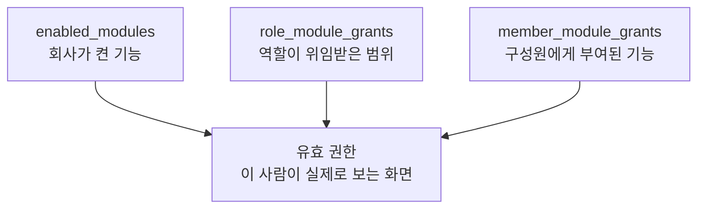

# AXpoint 스키마 관계도 v2 — 회사 단위 스키마 격리

`POSTGRESQL · 설계 초안 V2 · SHARED DATABASE, ISOLATED SCHEMA`

v1은 주요 테이블마다 `workspace_id`를 두고 RLS로 거르는 **공유 스키마** 방식이었고,
`organizations`(법인) → `workspaces`(요금제 단위) 2계층 구조였습니다.

v2는 **회사 하나 = 스키마 하나**로 맞춥니다. 중간 계층을 없앴으므로 `organizations`와
`workspaces`가 하나로 합쳐지고, `workspace_id` 컬럼이 전부 사라집니다.

회사의 **식별 키는 사업자번호**(유일성 보장), 회사의 **스키마 이름은 워크스페이스 PK**입니다.
`ax_00001` 처럼 접두사 + 0채움 순번이고, 회사명은 스키마 이름에 들어가지 않습니다.

| 스키마 | 테이블 | 테넌트 식별 키 | 스키마 이름 | 격리 수단 |
|---|---|---|---|---|
| `shared` | **6** | — (전역) | — | — |
| `ax_<PK 0채움 5자리>` | **26** | `workspaces.biz_number` | `workspaces.schema_name` | 스키마 경계 |

**합계 32 테이블.** v1은 상단에 33이라 적었지만 도메인별 목록을 합치면 32였습니다(12+7+4+9).
v2는 v1 `workspaces`(요금제 단위) 삭제(−1)와 `user_workspace_memberships` 신규(+1)로 32를
유지합니다. **v2의 `workspaces`는 이름만 같고 v1의 `organizations`(회사)를 이어받은 다른
테이블입니다.**

---

## 무엇이 달라지는가

| 항목 | v1 | v2 |
|---|---|---|
| 테넌트 단위 | 워크스페이스 (법인 아래 N개) | **회사. 1계층** (식별 키는 사업자번호) |
| 격리 수단 | `workspace_id` 컬럼 + RLS 정책 | 스키마 경계 (`search_path`) |
| 계층 | `organizations` → `workspaces`(요금제 단위) → 데이터 | `workspaces`(회사 = 전역 레지스트리) → 데이터 |
| `workspace_id` 컬럼 | 주요 테이블 전부 | **전면 삭제** |
| 자식 테이블 격리 | `receipt_lines` 등에 `workspace_id` 중복 저장 여부 미결 | **문제 소멸** |
| 격리 실패 시 | 정책 하나 누락 → 타 테넌트 노출 | 스키마가 다르면 테이블 이름부터 안 잡힘 |
| 전 테넌트 집계 | `GROUP BY workspace_id` 한 방 | **불가** — 스키마 순회 또는 별도 집계 |
| 마이그레이션 | 스키마 1개에 1회 | **전 스키마 순회** |
| Supabase RLS 전제 | 있음 | **없음** |

v1이 남겨둔 미결정 하나가 여기서 자동으로 해소됩니다. v1 "멀티테넌시 방식" 항목은
*"자식 테이블(`receipt_lines`, `member_module_grants`)에 `workspace_id`를 중복 저장할지"* 를
물었는데, v2에는 그 컬럼 자체가 없습니다.

---

## 테넌트 경계 — 회사



회사 하나에 스키마 하나입니다. 그 위에 회사를 묶는 계층은 없습니다.

### 스키마 이름 규칙 — 워크스페이스 PK

```
ax_<workspace PK · 0채움 5자리>

예) 1번째 가입 회사    → ax_00001
    2번째 가입 회사    → ax_00002
    142번째 가입 회사  → ax_00142
    100000번째         → ax_100000   (5자리를 넘으면 자연 증가)
```

`shared.workspaces.id`가 곧 스키마 이름입니다. **회사명은 스키마 이름에 들어가지 않습니다.**

**네 값이 각자 역할을 갖습니다.**

| | 컬럼 | 역할 | 변경 가능? |
|---|---|---|---|
| PK | `workspaces.id` | 스키마 이름의 유일한 재료. 순번 | 불변 |
| 식별 키 | `workspaces.biz_number` | 회사의 유일성 보장. 중복 가입 차단 | 사실상 불변 |
| 스키마 이름 | `workspaces.schema_name` | 실제 `search_path`에 들어가는 값 | **불변 (생성 후 고정)** |
| 표시 이름 | `workspaces.name` | 화면에 뿌리는 회사명 | 자유롭게 변경 |

**⚠ `workspaces.id`는 순번 PK여야 합니다.** UUID는 `ax_00001` 형태로 0채움할 수 없습니다.
`users`·`user_sessions`는 UUID를 유지하고 **`workspaces`만** `bigint GENERATED ALWAYS AS IDENTITY`로
둡니다. 따라서 `user_sessions.workspace_id`·`invitations.workspace_id`·`user_workspace_memberships.workspace_id`도
`bigint`가 됩니다.

**생성 규칙**

1. `shared.workspaces` INSERT → **DB가 PK를 채번** (`status = provisioning`)
2. `'ax_' || lpad(id::text, 5, '0')` 으로 스키마 이름 계산
3. `workspaces.schema_name`에 저장 — PK에서 계산 가능한 파생값이지만 **저장합니다**
4. 그 값으로 `CREATE SCHEMA`

**INSERT가 스키마 생성보다 먼저**라는 점이 슬러그 방식과 다릅니다. 이름을 만들려면 PK가 있어야
하기 때문입니다. 다행히 기존 프로비저닝 순서가 이미 이 형태였습니다.

3번에서 굳이 저장하는 이유는, 나중에 접두사나 자릿수 규칙을 바꾸더라도 **이미 만들어진
스키마가 그대로 찾아져야 하기** 때문입니다. 계산으로만 두면 규칙 변경이 곧 전 테넌트 장애입니다.

**접두사가 문법상 필수인 이유**

PostgreSQL 식별자는 숫자로 시작할 수 없습니다. `00001`은 그 자체로 스키마 이름이 될 수 없어
접두사가 반드시 필요합니다. `ax`는 AXpoint에서 왔습니다.

**5자리를 넘으면**

`lpad`는 자리수가 넘쳐도 자르지 않습니다. 10만 번째 회사는 `ax_100000`이 되고 규칙은 깨지지
않습니다. 사전순 정렬만 어긋나는데, 정렬이 필요하면 `workspaces.id`로 합니다.
**스키마 이름을 정렬 키로 쓰지 않습니다.**

**슬러그 방식에서 통째로 없어지는 것**

회사명 기반 슬러그를 검토했다가 PK 방식으로 바꾸면서 아래가 전부 불필요해졌습니다.

| 없어진 것 | 이유 |
|---|---|
| 법인격 표기 제거 (`(주)` `㈜` `Co., Ltd.`) | 회사명을 안 쓴다 |
| 국어의 로마자 표기법 변환 | 〃 |
| 중복 접미사 `_2` `_3` | PK가 유니크라 충돌이 **불가능**하다 |
| 빈 슬러그 → uuid 폴백 | PK는 항상 존재한다 |
| 예약어 차단 (`tenant_public` 등) | `ax_` + 숫자는 예약어가 될 수 없다 |
| 63바이트 한도 계산 | `ax_` + 5자리 = **8바이트**. 한도의 13% |
| 유니코드 정규화(NFC/NFD) 불일치 | 식별자에 ASCII만 들어간다 |
| 가입 화면의 슬러그 수정 UI | 사용자가 정할 값이 아니다 |

**대신 잃는 것 — 스키마만 보고 회사를 알 수 없다**

`\dn`을 치면 `ax_00001`, `ax_00002`만 나옵니다. 운영·디버깅 때마다 `shared.workspaces`를
조회해야 합니다. 이건 스키마 생성 시 코멘트를 달아 보완합니다.

```sql
COMMENT ON SCHEMA ax_00001 IS '㈜액스코어 / biz 1234567890';
```

`\dn+`에 코멘트가 함께 나오므로 psql에서 바로 확인됩니다. 회사명이 바뀌면 코멘트만 갱신하면
되고 **스키마 이름은 영향받지 않습니다.**

**상호가 바뀌면**

`workspaces.name`만 바꿉니다. 슬러그 방식에는 "상호는 바뀌었는데 스키마 이름은 옛 상호"라는
어긋남이 영구히 남았지만, PK 방식에는 애초에 그 어긋남이 없습니다. 이름과 식별자가 처음부터
분리돼 있기 때문입니다.

**PK를 스키마 이름으로 노출하는 것에 대해**

`ax_00042`는 "42번째 가입사"라는 정보를 담습니다. 가입사 수가 추측 가능해집니다. 다만 스키마
이름은 DB 내부 식별자라 외부 API·URL에 나가지 않으므로 실질 위험은 낮다고 봅니다.
외부에 테넌트 식별자를 노출해야 하는 화면이 생기면 `workspaces`에 **공개용 UUID 컬럼을 따로**
두고 그걸 내보냅니다. 스키마 이름을 그대로 쓰지 않습니다.

### ⚠ 스키마 이름은 SQL 인젝션 경계다

`CREATE SCHEMA`와 `SET search_path`는 **스키마 이름을 파라미터로 바인딩할 수 없습니다.**
JDBC `?` 플레이스홀더가 통하지 않아 문자열로 조립할 수밖에 없는 유일한 지점입니다.

**PK 방식은 이 지점의 위험을 사실상 없앱니다.** 스키마 이름의 재료가 사용자 입력이 아니라
DB가 채번한 정수라, 문자열이 조립되는 경로에 사람이 쓴 값이 들어갈 여지가 없습니다.
슬러그 방식에서는 회사명이 그 경로의 출발점이었습니다.

- **생성 시**: `'ax_' || lpad(id::text, 5, '0')`으로 만든 값을 `^ax_[0-9]{5,}$`로 검증하고,
  통과한 값만 `workspaces.schema_name`에 저장합니다.
- **사용 시**: DB에서 읽어온 `schema_name`을 같은 정규식으로 **한 번 더** 검증한 뒤에만
  쿼리에 넣습니다. DB에서 나온 값이라고 믿지 않습니다 — 비용이 정규식 하나라 뺄 이유가 없습니다.
- 사용자 입력(로그인 요청의 회사 선택값 등)을 스키마 이름으로 직접 쓰지 않습니다.
  반드시 `workspaces` 조회를 거쳐 나온 값만 씁니다.
- 사업자번호는 하이픈 제거 후 `^[0-9]{10}$`로 검증합니다(국세청 체크섬도 함께 권장).
  스키마 이름에는 쓰이지 않지만 여전히 테넌트 식별 키입니다.
- **예약어 차단 로직은 불필요합니다.** `ax_` + 숫자 조합은 PostgreSQL 예약어나
  `pg_*`·`information_schema` 같은 시스템 스키마 이름과 겹칠 수 없습니다.
- 다만 `COMMENT ON SCHEMA`에 들어가는 **회사명은 여전히 사용자 입력**입니다. 아래
  프로비저닝 절의 `%L` 이스케이프 항목을 참고합니다.

---

## 스키마 생성은 전부 자동화된다

**수동 작업은 없습니다.** 회사 가입 요청 한 번이 스키마 생성부터 기본 데이터 심기까지
끝냅니다. 이 방식에서 "스키마 관리가 복잡하다"는 단점은 *사람이 손으로 만든다*는 뜻이 아니라
*배포 때마다 N개를 순회해야 한다*는 뜻입니다.

### 신규 회사 프로비저닝



```java
// 개념 스케치. 실제 구현은 트랜잭션 경계와 검증을 함께 다룬다.
long id = workspace.getId();                                   // INSERT 후에만 알 수 있다
String schema = SchemaName.of(id);                             // "ax_" + %05d
SchemaName.validate(schema);                                   // ^ax_[0-9]{5,}$

jdbc.execute("CREATE SCHEMA " + schema);                       // 검증 통과값만 조립
jdbc.update("SELECT workspace_comment(?, ?)", schema, workspace.getName());

Flyway.configure()
      .dataSource(dataSource)
      .schemas(schema)                 // 이 스키마에만 적용
      .defaultSchema(schema)           // flyway_schema_history 도 이 안에 생성
      .locations("classpath:db/migration/tenant") // shared 용과 분리된 경로
      .group(true)                     // 전체 마이그레이션을 한 트랜잭션으로 묶는다
      .load()
      .migrate();
```

`workspace_comment(schema, label)`는 `EXECUTE format('COMMENT ON SCHEMA %I IS %L', $1, $2)`
한 줄짜리 함수입니다. `COMMENT ON`은 유틸리티 문이라 `?` 바인딩을 받지 않아 회사명을 문자열로
조립할 수밖에 없는데, `%L`이 이스케이프를 서버 쪽에서 대신해 줍니다. 코멘트는 운영 편의용
부가 정보이므로 **실패해도 프로비저닝을 막지 않게** 둡니다.

**핵심은 프로비저닝과 마이그레이션이 같은 스크립트를 쓴다는 점입니다.** 신규 회사는
"빈 스키마에 마이그레이션을 처음부터 전량 적용"한 것이고, 기존 회사는 "밀린 것만 적용"한
것입니다. 두 경로가 갈리지 않으므로 *새로 만든 스키마만 구조가 다른* 사고가 나지 않습니다.

### 실패하면 반쪽 스키마가 남지 않는다

PostgreSQL은 **DDL이 트랜잭션 안에서 롤백됩니다.** `CREATE TABLE` 12개를 만들다 13번째에서
실패하면 앞의 12개도 사라집니다. MySQL에서는 불가능한 동작이고, 이 방식을 실용적으로
만들어주는 핵심 성질입니다.

- Flyway는 기본적으로 **마이그레이션 파일마다** 트랜잭션을 나눕니다. 프로비저닝은 전량이
  한 덩어리여야 하므로 `group(true)`로 묶습니다.
- `CREATE SCHEMA`까지 같은 트랜잭션에 넣으면 실패 시 스키마 자체가 사라져 재시도가 깔끔합니다.
- `shared.workspaces` INSERT는 별도 트랜잭션으로 두고 `status`로 상태를 표현합니다.
  `provisioning` 상태로 오래 머문 행은 실패한 것이므로 정리 대상입니다.
- **실패한 PK는 재사용하지 않습니다.** identity 시퀀스는 롤백돼도 되감기지 않으므로
  `ax_00007`에서 실패하면 다음 회사는 `ax_00008`이 됩니다. 번호에 구멍이 생기지만
  스키마 이름은 순번일 뿐 개수를 세는 값이 아니므로 문제되지 않습니다.

### 배포 시 전 스키마 순회

기존 회사들에 새 마이그레이션을 반영하는 쪽이 실제 부담입니다.

```
shared 마이그레이션 1회
  ↓
shared.workspaces 에서 active 스키마 목록 조회
  ↓
각 스키마에 대해 Flyway.migrate()   ← 스키마 수만큼 반복
```

- **앱 부팅 시점에 돌리지 않는 편이 낫습니다.** 스키마가 늘수록 부팅이 선형으로 느려지고,
  인스턴스 여러 대가 동시에 부팅하면 같은 스키마를 동시에 건드립니다. 별도 마이그레이션
  잡(또는 CLI 커맨드)으로 분리하고, 앱은 `validate`만 하도록 둡니다.
- 동시 실행 자체는 Flyway가 `pg_advisory_lock`으로 막아줍니다. 다만 락 대기로 배포가
  길어질 뿐이라, 잡을 하나로 유지하는 게 맞습니다.
- 각 테넌트 스키마는 **자기 `flyway_schema_history`를 갖습니다.** 그래서 일부 스키마만
  실패해도 나머지는 영향받지 않고, 실패한 것만 재시도하면 됩니다.
- `shared.workspaces.schema_version` 컬럼을 두면 어디까지 적용됐는지를 앱에서도 볼 수 있어
  부분 실패 추적이 쉬워집니다.
- 스키마마다 DDL 락이 걸립니다. 테이블 rewrite가 필요한 마이그레이션(컬럼 타입 변경 등)은
  회사 수가 늘어난 뒤에는 무중단 전략이 따로 필요합니다.

### 삭제도 자동화하되 즉시 지우지 않는다

`DROP SCHEMA ax_00001 CASCADE` 한 줄이면 되지만, **되돌릴 수 없습니다.**
`status = terminated`로 soft delete → 유예기간(예: 30일) 경과 → 배치가 실제 `DROP`,
그 전에 덤프를 남기는 순서를 권합니다.

### Hibernate `ddl-auto`로는 이게 안 된다

`ddl-auto`는 엔티티에서 DDL을 만들 뿐 **스키마 목록을 순회하지 않고**, 컬럼 변경·데이터
이관·기본 데이터 심기를 표현하지 못합니다. 프로비저닝 코드를 따로 짜야 하고, 그러면
"프로비저닝과 마이그레이션이 같은 스크립트"라는 이점이 사라집니다. 아래 "결정이 필요한 것"의
Flyway 권고가 여기서 나옵니다.

---

## shared 스키마 — 6 tables

로그인 시점에는 **아직 어느 회사인지 모릅니다.** 이메일 하나로 계정을 찾아야 하는데 전 스키마를
뒤질 수는 없으므로, 인증에 필요한 것과 회사 선택 화면에 필요한 것은 전역에 둡니다.



| 테이블 | 핵심 필드 | 왜 전역인가 |
|---|---|---|
| **`workspaces`** | **`id`**(bigint PK) · `biz_number` · **`schema_name`** · `name` · `ceo_name` · `plan` · `status` | 테넌트 레지스트리. 회사 선택 화면이 로그인 직후·스키마 진입 전에 회사명을 보여줘야 한다. `id`가 스키마 이름의 재료다 |
| `users` | `email` · `password_hash` · `password_changed_at` · `avatar_url` · `last_login_at` | 이메일로 계정을 찾는 시점에 테넌트가 미정 |
| **`user_workspace_memberships`** | `user_id` · `workspace_id` · `status` | **신규.** "이 사람이 들어갈 수 있는 회사" 목록 |
| `user_sessions` | `token_hash` · **`workspace_id`** · `user_agent` · `ip` · `expires_at` · `revoked_at` | 세션 검증이 회사 선택보다 먼저 일어난다 |
| `user_mfa_methods` | `method` · `enabled` · `secret_ref` · `verified_at` | 비밀번호 검증 직후 단계라 테넌트 미정 |
| `invitations` | `email` · `token_hash` · **`workspace_id`** · `role_id` · `department_id` · `status` · `expires_at` | 초대 링크를 여는 사람은 로그인 전이다. 토큰으로 회사를 찾아야 한다 |

### `workspaces` — v1의 `organizations` + `workspaces`가 합쳐진 것

> **이름이 겹치니 주의합니다.** v1의 `workspaces`는 *법인 아래의 요금제 단위*였고,
> v2의 `workspaces`는 *회사 그 자체*입니다. 실질적으로 v1의 `organizations`가 이 자리를
> 이어받았고, 거기에 v1 `workspaces`의 plan·name 이 흡수됐습니다.
> 설계 초안은 이 테이블을 `tenants`로 불렀지만 스키마 이름이 이 행의 PK에서 나오므로
> 코드·DB와 맞춰 `workspaces`로 확정했습니다.

v1은 `organizations`(법인번호·법인명·대표자)와 `workspaces`(요금제·이름)를 나눴습니다.
v2는 회사가 곧 테넌트라 둘을 나눌 이유가 없습니다.

| v1 위치 | v1 필드 | v2 위치 |
|---|---|---|
| `organizations` | `biz_number` · `name` · `ceo_name` | `shared.workspaces` |
| `workspaces` | `plan` · `name` | `shared.workspaces` |
| `workspaces` | `organization_id` | **삭제** (계층이 없음) |
| — | `schema_name` | `shared.workspaces` — 신규 필드 |

회사의 상세 설정(로고, 주소, 업무 규칙 등)이 늘어나면 테넌트 스키마 안에 1행짜리
`company_profile`을 두고, `shared.workspaces`에는 **로그인 전에 필요한 최소 필드만** 남깁니다.
지금은 그 분리가 필요한 수준이 아니라 두지 않았습니다.

### 신규 테이블 — `user_workspace_memberships`

v1에서는 `workspace_members`를 `user_id`로 조회하면 소속을 전부 알 수 있었습니다. v2에서
구성원 정보는 각 테넌트 스키마에 흩어지므로, 전 스키마를 순회하지 않고 소속을 알려면
전역 인덱스가 하나 필요합니다.

```
user_workspace_memberships (user_id, workspace_id, status)
  ux: (user_id, workspace_id)
```

- 진짜 소속 정보(역할·부서·모듈 권한)는 여전히 테넌트 스키마의 `members`에 있습니다.
  이 테이블은 **"어느 스키마를 열어야 하는가"만 답하는 라우팅 인덱스**입니다.
- 그래서 두 곳이 어긋날 수 있습니다. `members` 생성·삭제와 같은 트랜잭션에서 갱신해야 하고,
  이건 크로스 스키마 트랜잭션이지만 **같은 DB라 원자성이 보장됩니다.** 스키마 격리를
  DB 분리 대신 택한 이득이 여기서 나옵니다.
- 같은 계정이 A사에서는 관리자, B사에서는 구성원일 수 있다는 v1의 전제는 그대로입니다.
  그래서 `users`가 전역이고 이 인덱스가 필요합니다.

### `invitations`를 전역에 두는 이유

초대는 "아직 계정이 없는 사람"이 대상입니다. 초대 링크를 클릭한 시점에 사용자는 로그인
상태가 아니고 서버가 가진 정보는 URL의 토큰뿐입니다. 이 토큰으로 어느 회사의 초대인지
알아내야 `search_path`를 정할 수 있으므로 전역이어야 합니다.

`role_id`·`department_id`는 테넌트 스키마의 값을 가리키는 크로스 스키마 참조가 됩니다.
초대 행은 수명이 짧고 양이 적어 이대로 두는 편이 단순합니다. 다만
`invitation_module_grants`는 `module_slug`가 테넌트의 `enabled_modules`와 맞물리므로
테넌트 스키마에 둡니다.

---

## 테넌트 스키마 — 26 tables

도메인 구성과 관계는 v1과 같습니다. 아래는 v1 대비 달라지는 점만 정리합니다.

### 회원 · 조직 — 6 tables



| v2 테이블 | v1 이름 | 변경 |
|---|---|---|
| `members` | `workspace_members` | **개칭.** `workspaces` 테이블이 없어져 `workspace_` 접두사가 무의미해졌다. `workspace_id` 컬럼 삭제, `user_id`는 `shared.users`를 가리킴 |
| `roles` | `roles` | **`organization_id` 컬럼 삭제** — 스키마 전체가 한 회사라 테넌트 전역 역할이다 |
| `departments` | `departments` | **`organization_id` 컬럼 삭제** — 위와 같음 |
| `role_module_grants` | 동일 | 변경 없음 |
| `member_module_grants` | 동일 | 변경 없음 |
| `invitation_module_grants` | 동일 | `invitation_id`가 `shared.invitations`를 가리키는 크로스 스키마 참조가 됨 |

> **역할은 사람이 아니라 "사람 × 회사"에 붙습니다.** v1의 이 원칙은 그대로 유지되는데,
> 표현 방식이 더 자연스러워졌습니다. `role_id`가 `users`가 아니라 `members`에 있고,
> `members`는 애초에 회사 스키마 안에만 존재하기 때문입니다.

### 권한 3층은 그대로



세 테이블이 전부 같은 스키마 안에 있으므로 교집합 계산이 **더 단순해집니다** — 조인에
`workspace_id` 조건을 반복해 붙일 필요가 없습니다. "유효 권한" 테이블은 v1처럼 두지 않고
세 테이블의 교집합으로 계산합니다.

### 설정 · 연동 — 7 tables

| v2 테이블 | v1 이름 | 변경 |
|---|---|---|
| `enabled_modules` | `workspace_modules` | **개칭** + `workspace_id` 삭제 |
| `enabled_subfunctions` | `workspace_subfunctions` | **개칭** + `workspace_id` 삭제 |
| `connectors` | 동일 | `workspace_id` 삭제 |
| `service_connections` | 동일 | `workspace_id` 삭제 |
| `notification_prefs` | 동일 | `workspace_id` 삭제 |
| `module_sync_rules` | 동일 | `workspace_id` 삭제 |
| `audit_logs` | 동일 | `workspace_id` 삭제. `actor_member_id`는 `members`를 그대로 가리킴 |

- `credential_ref` / `token_ref`로 비밀 저장소 참조만 두는 원칙은 v1 그대로입니다. 스키마가
  분리돼도 DB 덤프에 시크릿이 들어가면 안 되는 건 동일합니다.
- `audit_logs`가 테넌트 스키마에 있으므로 **회사별 감사 로그 분리 보관과 개별 보존기간 적용이
  가능해집니다.** v1 대비 실질적인 이득입니다.

### 제품설계 — 4 tables

`projects` · `drawings` · `drawing_revisions` · `bom_lines`

| 자식 (FK 보유) | 부모 | 변경 |
|---|---|---|
| ~~`projects.workspace_id`~~ | ~~`workspaces`~~ | **삭제** — 격리는 스키마가 한다 |
| `drawings.project_id` | `projects` | 변경 없음 (원본만 보유, 파생은 NULL) |
| `drawings.parent_drawing_id` | `drawings` | 변경 없음 — 자기참조, 파생 도면의 상위 |
| `drawing_revisions.drawing_id` | `drawings` | 변경 없음 |
| `bom_lines.drawing_id` | `drawings` | 변경 없음 |

`projects`가 관리번호 허브라는 성격, `parent_drawing_id` + `parent_rev`를 함께 봐야
"원본은 Rev.C인데 파생은 Rev.A 기준" 불일치를 잡는다는 설계는 v1 그대로입니다.

### 재고 · 물류 — 9 tables

`items` · `suppliers` · `purchase_orders` · `purchase_order_lines` · `receipts` ·
`receipt_lines` · `warehouses` · `stock_movements` · `stock_balances`

- 모든 테이블에서 `workspace_id`가 빠집니다. v1이 "자식 테이블에는 컬럼이 없어 조인이 필요하다"고
  적어둔 문제가 사라집니다.
- 수량이 `stock_movements` 한 곳에서만 만들어지고 `stock_balances`는 집계 캐시라는 원칙,
  `bom_lines.item_id`(설계↔재고 다리)와 `stock_movements.receipt_line_id`(검수→재고 다리)는
  v1과 동일하게 동작합니다. 세 다리 모두 같은 스키마 안에서 끝납니다.

---

## 크로스 스키마 참조 — 3개소

테넌트 스키마에서 `shared`를 가리키는 지점은 셋뿐입니다.

```
ax_00001.members.user_id                        → shared.users(id)
ax_00001.invitation_module_grants.invitation_id → shared.invitations(id)
shared.invitations.role_id / department_id      → ax_00001.roles / departments   (역방향)
```

PostgreSQL은 같은 DB 안이면 스키마를 넘는 FK를 허용합니다. 다만 **실제로 FK를 걸지는
결정이 필요합니다.**

| | FK를 건다 | FK 없이 애플리케이션 참조 |
|---|---|---|
| 정합성 | DB가 보장. 고아 행 불가 | 코드가 보장. 버그 시 고아 행 발생 |
| **테넌트 단독 백업** | **`pg_dump -n ax_00001` 결과물을 `shared` 없는 DB에 복원할 수 없다** | 단독 복원 가능 |
| 테넌트 삭제 | `DROP SCHEMA ... CASCADE`가 `shared` 제약에 안 걸림(방향이 반대) | 동일 |
| `shared.users` 삭제 | 전 테넌트 스키마의 FK를 검사 → 스키마가 많으면 느려짐 | 영향 없음 |
| 역방향 참조 | `shared.invitations` → 테넌트 스키마는 FK를 걸 수 없다(테넌트가 동적) | 애초에 이쪽만 가능 |

**정방향(테넌트 → shared)에는 FK를 걸고, 역방향(`invitations.role_id` 등)에는 걸지 않습니다.**
역방향은 대상 스키마가 행마다 다르므로 FK로 표현할 방법이 없습니다. 수락 처리 시점에
애플리케이션이 검증합니다.

"테넌트 단위 백업"은 스키마 격리의 대표 장점으로 꼽히지만, 이 프로젝트에서는 `shared`가 없으면
로그인 자체가 안 되므로 반쪽짜리입니다. 계정 데이터 없는 테넌트 덤프는 쓸 데가 적고,
정합성을 잃는 대가가 더 큽니다.

사용자를 물리 삭제하지 않고 `status`로 비활성 처리하면 위 표의 넷째 행 문제가 실질적으로
사라집니다. **소프트 삭제를 기본으로 합니다.**

---

## 애플리케이션 쪽 파급 — DB 설계에서 미리 정해야 하는 것

### 1. 커넥션마다 `search_path`를 세팅하고, 반납 전에 되돌린다

HikariCP는 커넥션을 재사용합니다. 회사 A의 요청이 쓴 `search_path`가 남은 채 커넥션이 풀로
돌아가면, **다음 요청이 회사 B인데 A의 스키마를 읽습니다.** 이 방식에서 가장 위험한
단일 지점입니다.

- Hibernate 7의 `MultiTenantConnectionProvider` + `CurrentTenantIdentifierResolver`를 씁니다.
  `getConnection`에서 `SET search_path TO ax_00001, shared`, `releaseConnection`에서
  **반드시 초기화**합니다.
- 자체 구현하지 않고 프레임워크 표준 확장점을 쓰는 이유가 이것입니다(CLAUDE.md 보안 지침).
- 테넌트 컨텍스트 전파는 `ScopedValue`로 합니다. 가상 스레드를 켠 상태라 `ThreadLocal`은
  적합하지 않습니다. `docs/be/java-springboot-version.md`에서 Java 25를 고른 근거 중 하나가
  이 항목이었고, RLS에서 스키마 격리로 바뀐 뒤에도 그대로 유효합니다.

### 2. PgBouncer를 쓸 거면 transaction 모드는 못 쓴다

`SET search_path`는 세션 레벨 상태입니다. PgBouncer의 transaction pooling은 트랜잭션마다
백엔드 커넥션을 바꾸므로 세션 상태가 유실됩니다. 세션 모드로 쓰거나 PgBouncer를 두지 않고
HikariCP만 씁니다. **인프라 결정이므로 지금 못 박아두는 편이 낫습니다.**

### 3. JPA 엔티티에 스키마를 하드코딩하지 않는다

- 테넌트 테이블: `@Table(name = "members")` — 스키마 생략. `search_path`가 결정합니다.
- 전역 테이블: `@Table(name = "users", schema = "shared")` — 고정 명시.

지금 커밋된 `User`·`UserSession` 엔티티는 스키마 미지정 상태라 **`shared` 명시가 필요합니다.**

### 4. 로그인 흐름이 바뀐다

```
1. shared.users 에서 이메일로 조회 → 비밀번호 검증          (테넌트 무관)
2. shared.user_workspace_memberships 로 접근 가능 회사 목록 조회
3. 회사 선택 → shared.workspaces.schema_name 확보
4. shared.user_sessions 에 workspace_id 와 함께 세션 발급
5. 이후 요청: 세션 → workspace_id → schema_name → search_path
```

- `user_sessions.workspace_id`는 **nullable**로 둡니다. 로그인은 했지만 아직 회사를 선택하지
  않은 상태가 존재합니다(회사 선택 화면).
- 회사 전환은 세션 재발급 또는 `workspace_id` 갱신으로 처리합니다. 어느 쪽이든 전환 시점에
  `user_workspace_memberships`를 재확인해야 합니다 — 세션에 담긴 값을 믿고 `search_path`를
  세팅하면 소속이 회수된 뒤에도 접근이 열립니다.
- 소속 회사가 1개면 2~3단계를 건너뛰고 바로 진입시켜도 됩니다. 화면 흐름 결정이 필요합니다.

### 5. 전 테넌트 집계는 별도 경로가 필요하다

"전체 발주 건수", 운영 대시보드, 사용량 기반 과금 같은 쿼리가 v1에서는 `GROUP BY workspace_id`
한 줄이었지만 v2에서는 불가능합니다. 스키마 순회 UNION을 동적 생성하거나 집계 전용 테이블을
`shared`에 두고 배치로 채웁니다. **지금 필요한 화면은 없지만 과금이 붙는 순간 필요해집니다.**

### 6. FE 영향 — "워크스페이스 전환"의 의미가 바뀐다

사이드바의 워크스페이스 전환은 이제 **회사 전환 = 스키마 전환**입니다. 한 회사 안에서 여러
워크스페이스를 오가는 흐름은 없어집니다. `FE/data/*`의 워크스페이스 관련 목업과
`lib/module-state.ts`의 `localStorage` 모듈 상태(→ `enabled_modules`로 이관 예정)가
영향 범위입니다.

---

## 결정이 필요한 것

### ⚠ 마이그레이션 도구 — 이 변경의 최대 파급

스키마가 N개면 DDL을 N번 적용해야 합니다. 현재 `User.java` 주석에는 *"Flyway를 쓰지 않기로 해서"*
라고 적혀 있고 `application.properties`에 `spring.jpa.hibernate.ddl-auto`도 없어,
**지금 상태로는 테이블이 아무데서도 생성되지 않습니다.**

**Flyway 재도입을 권합니다.** 근거:

- 마이그레이션을 `shared`용과 `tenant`용으로 나누고, 테넌트용은 `shared.workspaces`의 스키마
  목록을 순회하며 같은 스크립트를 반복 적용하면 됩니다.
- **신규 회사 가입 = 빈 스키마 생성 + 테넌트 마이그레이션 전량 적용**이므로 프로비저닝과
  마이그레이션이 같은 코드 경로를 씁니다. 도구 없이 짜면 이 둘이 갈라져 어긋납니다.
- PostgreSQL은 DDL이 트랜잭션 안에서 롤백됩니다. 프로비저닝 실패 시 반쪽짜리 스키마가
  남지 않는 건 이 방식의 실질적 장점이고, 살리려면 도구가 트랜잭션 경계를 지켜줘야 합니다.
- Hibernate `ddl-auto`는 스키마 순회를 하지 않고 컬럼 변경·데이터 이관을 표현하지 못합니다.
  프로덕션 전에 어차피 교체 대상입니다.

배포 시 주의: 스키마가 늘수록 배포 시간이 선형으로 늘고 각 스키마에 DDL 락이 걸립니다.
`shared.workspaces`에 `schema_version` 컬럼을 두면 부분 실패를 추적하고 재개할 수 있습니다.

### Supabase 전제를 걷어낼지

v1은 `workspace_id` 기준 Supabase RLS를 전제했습니다. 스키마 격리로 가면 RLS 기반 보안 모델을
쓰지 않게 되고, PostgREST 자동 API도 스키마마다 노출 설정이 필요해 이점이 줄어듭니다.
`INFRA/docker-compose.db.yml`은 이미 자체 `postgres:18` 컨테이너이므로 **Supabase 전제를
버리는 쪽이 일관적입니다.** 단 `secret_ref`/`token_ref`가 가리킬 비밀 저장소는 여전히 필요하며
Vault·AWS Secrets Manager 등 선택은 별도 결정입니다.

### `workspaces.id` 타입 변경 — PK 스키마 이름의 전제

스키마 이름을 `ax_00001`로 정하면서 **`workspaces.id`는 UUID가 될 수 없습니다.** 0채움 순번이
나와야 하므로 `bigint GENERATED ALWAYS AS IDENTITY`로 둡니다. 파급은 `workspaces`를 참조하는
세 컬럼(`user_sessions.workspace_id` · `invitations.workspace_id` ·
`user_workspace_memberships.workspace_id`)이 `bigint`가 되는 것뿐이고, `users`·`user_sessions`의
PK는 UUID 그대로입니다.

대안으로 **`workspaces.id`를 UUID로 두고 순번 컬럼(`seq bigint identity`)을 따로 두는** 방법도
있습니다. 외부에 나가는 식별자는 UUID라 가입사 수가 추측되지 않는다는 이점이 있지만, 컬럼이
하나 늘고 "PK가 곧 스키마 이름"이라는 단순함이 깨집니다. **순번 PK를 기본으로 하고**,
외부 노출이 실제로 필요해지는 시점에 공개용 UUID 컬럼을 추가하는 편을 권합니다.

### 사업자번호가 없거나 중복되는 경우

- 해외 법인·개인사업자·내부 데모 계정은 사업자번호가 없거나 형식이 다릅니다. 스키마 이름이
  PK 기반이라 **스키마 생성 자체는 막히지 않지만**, `biz_number`를 NOT NULL
  유니크로 둘지가 미정입니다. NULL 허용 시 `unique nulls not distinct`를 쓰지 않도록
  주의해야 합니다(PostgreSQL 15+ 기본은 NULL을 서로 다른 값으로 봅니다).
- 폐업 후 같은 번호로 재등록되는 경우 기존 스키마를 재사용할지 새로 만들지 결정이 필요합니다.
  `workspaces.status`로 폐업을 표현하고 스키마는 남기는 편이 안전합니다. 새로 만들면 새 PK가
  나오므로 **새 스키마가 자동으로 생깁니다** — 슬러그 방식과 달리 이름 충돌을 다룰 일이 없습니다.

### v1에서 그대로 넘어온 미결정

- **모듈 카탈로그를 DB에 둘까** — `module_slug` 문자열 오타를 DB가 못 잡는 문제.
  카탈로그 테이블을 만든다면 v2에서는 배치가 추가로 갈리는데, 전 테넌트가 같은 카탈로그를
  쓰므로 **`shared`에 두는 게 맞습니다.**
- **역할 고정 vs 자유** — 시스템 기본 역할 + 커스텀 역할 혼합 구조. 기본 역할은 프로비저닝
  스크립트가 새 스키마에 심어주는 방식이 됩니다.
- **BOM 리비전 스냅샷** — `bom_lines.rev` 문자열 유지 여부. v2와 무관.
- **상태값 표현** — `VARCHAR` + 한글 리터럴. v2와 무관.
- **아직 없는 것** — 안전재고 기준(별도 테이블로 설계 예정), 출고 요청·재고 실사,
  소셜 로그인(`user_identities` — 전역이므로 `shared` 소속. 추가되면 shared 7 tables).

---

## 요약

```
shared (6)
  workspaces                 회사 = 워크스페이스 레지스트리
                             id(bigint PK → 스키마 이름) · biz_number(식별)
                             schema_name(ax_00001) · name(표시) · plan
  users                      로그인 계정
  user_workspace_memberships 계정 → 접근 가능 회사 (신규)
  user_sessions              세션 (+ workspace_id)
  user_mfa_methods           2단계 인증
  invitations                초대 (+ workspace_id)

ax_<PK 0채움 5자리> (26)
  회원·조직 6   members · roles · departments
                role_module_grants · member_module_grants · invitation_module_grants
  설정·연동 7   enabled_modules · enabled_subfunctions · connectors
                service_connections · notification_prefs · module_sync_rules · audit_logs
  제품설계 4    projects · drawings · drawing_revisions · bom_lines
  재고·물류 9   items · suppliers · purchase_orders · purchase_order_lines
                receipts · receipt_lines · warehouses · stock_movements · stock_balances
```

### v1 → v2 테이블 대조

| v1 | v2 | 처리 |
|---|---|---|
| `organizations` | `shared.workspaces` | 개칭(→ `workspaces`) + `schema_name` 추가 |
| `workspaces`(v1: 요금제 단위) | — | **삭제** (회사와 1:1이라 중복) |
| `workspace_members` | `tenant.members` | 개칭 + `workspace_id` 삭제 |
| `workspace_modules` | `tenant.enabled_modules` | 개칭 + `workspace_id` 삭제 |
| `workspace_subfunctions` | `tenant.enabled_subfunctions` | 개칭 + `workspace_id` 삭제 |
| `users` · `user_sessions` · `user_mfa_methods` · `invitations` | `shared.*` | 이동 (+`workspace_id`) |
| — | `shared.user_workspace_memberships` | **신규** |
| 나머지 23개 | `tenant.*` | 이동 + `workspace_id` / `organization_id` 삭제 |

`AXPOINT · DB SCHEMA DRAFT v2` — `32 TABLES / SHARED 6 + TENANT 26`

---

### v1과의 관계

이 문서는 `docs/db/schema-draft-v1.md`를 대체합니다. v1은 공유 스키마 + RLS 방식의 기록으로
남겨둡니다. 화면 근거·업무 흐름 서술은 v1이 더 상세하며, v2에서 바뀌지 않은 부분은 v1을
그대로 참조하면 됩니다.
